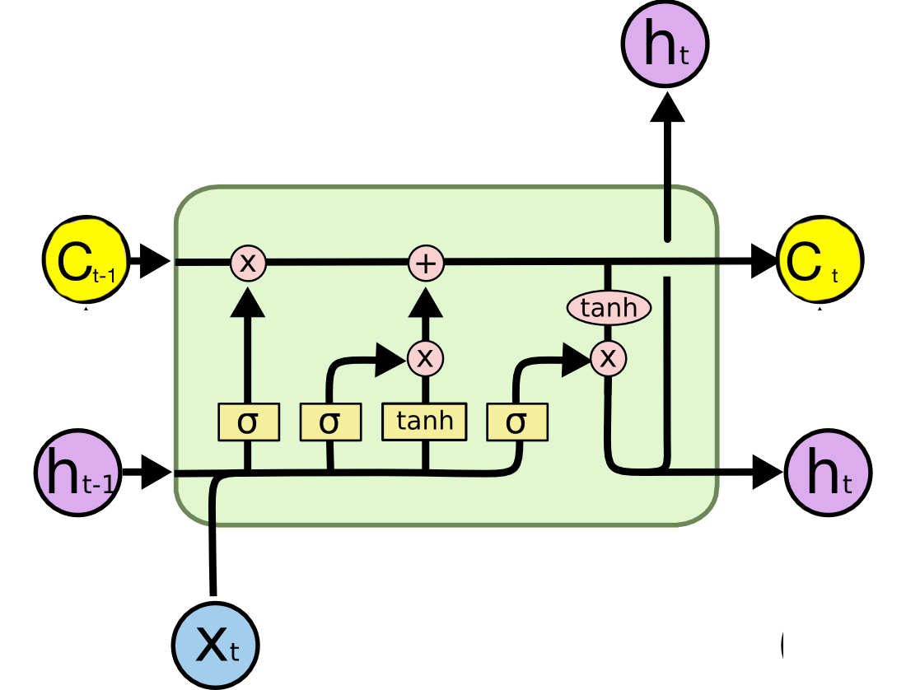
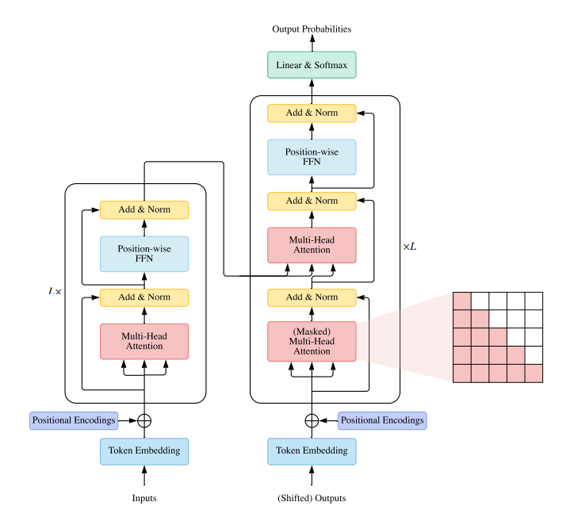

# 一、神经网络结构概述

## 1.1 神经网络介绍
神经网络，通常指代人工神经网络（Artificial Neural Networks, ANN），是一种计算模型，其灵感来源于生物神经系统，尤其是人脑中的神经元网络。神经网络被设计用来识别模式、分类数据、回归预测、生成内容等，在机器学习和人工智能领域有着广泛的应用。

## 1.2 神经网络中的专有名词

神经网络中的专有名词众多，涵盖了从基本组件到高级架构的各个方面。下面我将尽可能全面地介绍神经网络中的核心名词，按照不同的模块来划分：

### 1.2.1 基础组件

- **神经元（Neuron）**：
神经网络的基本单位，模仿了生物神经元的行为。它接收输入信号，通过加权求和，加上偏置（bias），并经过激活函数处理后产生输出。

- **权重（Weights）**：
连接神经元的参数，表示输入信号的重要性。权重在训练过程中会被优化，以使网络的预测更加准确。

- **偏置（Bias）**：
每个神经元都有一个偏置项，允许模型适应数据中可能存在的偏移，提高模型的灵活性。

### 1.2.2 网络结构

- **输入层（Input Layer）**：
接收原始数据的层，神经元数量等于输入特征的数量。

- **输出层（Output Layer）**：
网络的最后一层，其神经元数量和类型取决于任务，例如对于分类问题，神经元数量通常等于类别数。

- **隐藏层（Hidden Layers）**：
位于输入层和输出层之间的层，用于提取和变换特征。隐藏层数量和每层神经元数量影响网络的复杂性和表达能力。

- **激活函数（Activation Function）**：
每个神经元都会应用一个激活函数，用于将加权求和的结果映射到输出范围。常见的激活函数有Sigmoid、ReLU、Tanh等。

当然，在一个神经网络中，不同的层的形状或是组成可能并不相同，而这就是需要人为设计的内容。以下表格就是关于神经网络结构层的发展历史，现在仅做一个简单的了解，后续我们将展开深入研究。


| 网络结构   | 时间          | 创新点                                                                                   | 应用领域                                                     |
|------------|---------------|------------------------------------------------------------------------------------------|--------------------------------------------------------------|
| 感知机     | 1957年        | 第一种能够自动学习权重的神经网络模型，基于线性决策边界。                                 | 二分类问题，线性可分的数据集                                  |
| MLP (多层感知机) | 1980年年代        | 引入了梯度下降方法来调整多层神经网络的权重，解决了深层网络的训练问题。                 | 图像识别，语音识别，自然语言处理                               |
| CNN (卷积神经网络) | 1990年代初     | 使用卷积层和池化层捕捉局部特征和位置不变性。                                           | 计算机视觉，图像和视频分析                                    |
| RNN (循环神经网络) | 1990年代       | 允许信息在时间序列中向前和向后传播，适用于序列数据。                                   | 语音识别，时间序列预测，自然语言处理                           |
| LSTM (长短期记忆网络) | 1997年        | 解决了RNN的长期依赖问题，通过门控机制控制信息的流动。                                  | 文本生成，语音识别，机器翻译                                  |
| GRU (门控循环单元) | 2014年        | 类似LSTM但结构更简单，减少了参数数量，也有效解决长期依赖问题。                         | 同LSTM                                                       |
| GNN (图神经网络)   | 2009年后      | 在图结构数据上操作，能够处理节点和边的属性，捕捉图的结构信息。                          | 社交网络分析，推荐系统，化学分子结构分析                      |
| Transformer | 2017年        | 引入了自注意力机制，避免了RNN和CNN的序列依赖，加速了训练过程。                         | 机器翻译，文本摘要，问答系统                                  |
| Mamba      | 2023年          | | 序列任务        |

## 1.2.3 传播


在这张图中，不同`w`代表的就是参数，也就是单个节点，它们组合在一起就是一个网络层。`b`是偏置，`a`代表的是激活函数。当输入特征经过这个网络层时，通过`w`和`b`的加权求和，再加上偏置，然后经过激活函数处理，最终输出一个值。而这个过程就是**正向传播（forward）**。

而神经网络的训练通常是通过**反向传播（backpropagation）** 来实现的。反向传播的过程是：

- 首先，计算损失函数（loss function）对网络中每个参数的梯度。
- 然后，根据梯度更新网络的参数。
- 重复以上步骤，直到损失函数收敛或达到预设的迭代次数。

简单来说就是通过最小化损失函数，来使得模型获得更好的预测能力。

# 二、神经网络结构介绍

这里，我们介绍神经网络的架构仅从原理角度出发，而不牵扯到太多其他任务，同时相对复杂一些的结构，大家可以不求甚解，在后期任务专栏中再深入探讨。

### 2.1 MLP (多层感知机)

#### 2.1.1 背景与动机

多层感知机（Multilayer Perceptron, MLP）的概念源于早期的感知机模型，最初由Frank Rosenblatt在1957年提出。然而，感知机模型的局限性在于它只能解决线性可分的问题，即无法处理异或(XOR)这样的非线性问题。为了解决这个问题，研究人员开始探索多层神经网络的可能性，其中每一层包含多个简单的感知机单元，通过非线性激活函数和权重连接起来，形成了多层感知机。这种架构的提出，主要是为了增强神经网络的学习能力和表达能力，使其能够处理更复杂的非线性映射关系。

1986年，David Rumelhart、Geoffrey Hinton和Ronald Williams等人发表了著名的论文《Learning representations by back-propagating errors》，在这篇论文中，他们不仅详细阐述了反向传播算法，还展示了如何使用反向传播算法训练多层神经网络。这一突破使得多层感知机成为了深度学习领域的基石之一，开启了神经网络在复杂任务上的广泛应用。

#### 2.1.2 结构详细介绍

多层感知机是一种前馈神经网络，其结构通常包括：
- **输入层**：接收原始输入数据，输入层的神经元数量通常与输入特征的数量相同。
- **隐藏层**：位于输入层和输出层之间的一层或多层神经元。隐藏层的神经元通过权重与前一层神经元相连，并通过激活函数处理信号。隐藏层的数量和每层神经元的数量可以根据任务的复杂性进行调整。
- **输出层**：产生最终输出，输出层的神经元数量通常取决于任务类型，例如在分类任务中，输出层神经元的数量通常等于类别数量。

每个神经元的工作流程如下：
1. 接收来自前一层神经元的加权输入。
2. 将所有输入加权求和，并加上偏置项。
3. 将加权和通过激活函数（如ReLU、sigmoid、tanh等），产生神经元的输出。

#### 2.1.3 代码实现 (PyTorch)

以下是使用PyTorch构建一个简单的多层感知机的示例代码：

```python
import torch
import torch.nn as nn

# 定义多层感知机模型
class MLP(nn.Module):
    def __init__(self, input_size, hidden_size, output_size):
        super(MLP, self).__init__()
        self.fc1 = nn.Linear(input_size, hidden_size)  # 第一个全连接层
        self.relu = nn.ReLU()  # ReLU激活函数
        self.fc2 = nn.Linear(hidden_size, output_size)  # 第二个全连接层

    def forward(self, x):
        out = self.fc1(x)
        out = self.relu(out)
        out = self.fc2(out)
        return out

# 实例化模型
input_size = 784  # 假设输入是28x28的图像，共784个像素
hidden_size = 128
output_size = 10  # 假设有10个类别
model = MLP(input_size, hidden_size, output_size)

# 创建随机输入数据
x = torch.randn(1, input_size)

# 前向传播
output = model(x)
print(output)
```

### 2.2 CNN (卷积神经网络)

#### 2.2.1 背景与动机

卷积神经网络（Convolutional Neural Networks, CNN）是深度学习领域中一种重要的网络结构，主要用于处理具有网格结构的数据，如图像。CNN的灵感来源于生物学，尤其是对猫和猴子视觉皮层的研究，发现视觉皮层中的神经元对特定区域的刺激有选择性响应，这些区域被称为感受野。在CNN中，卷积层模仿了生物视觉系统的这一特性。

CNN的主要优势在于其对空间结构信息的有效利用，通过局部连接、权重共享和下采样等操作，CNN能够有效地减少模型参数量，同时保持对输入数据的空间层次结构的敏感度。这对于图像分类、目标检测、语义分割等计算机视觉任务至关重要。

#### 2.2.2 结构详细介绍

卷积层是卷积神经网络（Convolutional Neural Networks, CNNs）的核心组成部分，专门设计用于处理具有网格结构的数据，如图像、视频和音频信号。

我们以二维卷积核作为示例，它由一组滤波器组成，每个滤波器都具有一个权重和偏置。卷积核在输入数据上滑动，并计算每个位置的局部区域与滤波器的卷积。卷积核的移动和卷积操作的结合，使得CNN能够提取输入数据中不同尺度的特征。

具体的情况就如下图所示：


由卷积的形式我们可以得到卷积网络的一些性质：

1. **参数共享**：卷积层的滤波器在整个输入上共享同一组权重，这大大减少了参数的数量，降低了过拟合的风险，并提高了计算效率。
2. **平移不变性**：卷积层能够检测图像中的特征，无论这些特征出现在图像的哪个位置，这提高了模型的泛化能力。
3. **局部连接**：卷积层中的每个滤波器只与输入数据中的局部区域相连，这减少了网络的计算复杂度。

这些优势使得CNN在图像处理、目标检测、语义分割等领域得到了广泛的应用。

#### 2.2.3 代码实现 (PyTorch)

我们通过Pytorch来实现一个最简单的图像分类网络：

```python
import torch
import torch.nn as nn

class SimpleCNN(nn.Module):
    def __init__(self):
        super(SimpleCNN, self).__init__()
        self.conv1 = nn.Conv2d(3, 16, kernel_size=3, stride=1, padding=1)
        self.relu = nn.ReLU()
        self.pool = nn.MaxPool2d(kernel_size=2, stride=2)
        self.fc = nn.Linear(16 * 8 * 8, 10)

    def forward(self, x):
        x = self.conv1(x)
        x = self.relu(x)
        x = self.pool(x)
        x = x.view(x.size(0), -1)
        x = self.fc(x)
        return x

# 创建模型实例
model = SimpleCNN()

# 创建随机输入数据
input_data = torch.randn(1, 3, 32, 32)

# 前向传播
output = model(input_data)
```

### 2.2 RNN (循环神经网络)

#### 2.2.1 背景与动机

循环神经网络（Recurrent Neural Network, RNN）是神经网络的一种变体，设计**用于处理序列数据**，如时间序列、文本、语音和其他按时间顺序排列的数据。传统的前馈神经网络（如CNN）在处理固定长度的输入时表现良好，但在处理长度可变的序列数据时存在局限性。**RNN通过引入循环连接，使得网络能够在时间上“记住”之前的输入状态，从而解决了这一问题**。

RNN的动机主要来自于自然语言处理和时间序列预测等场景，其中序列数据的上下文信息至关重要。例如，在处理一段文本时，当前词的意义往往依赖于前面的词汇；在时间序列分析中，未来值的预测通常基于过去的数据点。RNN通过维护一个隐藏状态，该状态在序列的不同时间点之间传递，从而捕捉这种长期依赖关系。

#### 2.2.2 结构详细介绍

RNN的基本单元是一个具有循环连接的神经网络层。在每个时间步，RNN接收当前时刻的输入和前一时刻的隐藏状态，然后计算出当前时刻的输出和新的隐藏状态。这个过程可以用以下公式描述：

$$h_t = f(W_{ih}x_t + W_{hh}h_{t-1} + b)$$
$$y_t = g(W_{hy}h_t + b_y)$$

其中，
-  $h_t$ 是在时间步 $t$ 的隐藏状态，
-  $x_t$ 是在时间步 $t$ 的输入，
-  $y_t$ 是在时间步 $t$ 的输出，
-  $W_{ih}$ ,  $W_{hh}$ ,  $W_{hy}$ 是权重矩阵，
-  $b$ ,  $b_y$ 是偏置项，
-  $f$ 和  $g$ 分别是激活函数。

RNN的关键特性是隐藏状态 $h_t$ ，它不仅取决于当前的输入 $x_t$ ，还取决于前一时刻的隐藏状态 $h_{t-1}$ ，这使得网络能够捕获序列中的长期依赖关系。其展示开就如图所示：


然而，标准的RNN在处理非常长的序列时面临所谓的“梯度消失”或“梯度爆炸”问题，这限制了它们在长序列上的性能。为了解决这个问题，研究者提出了几种改进的RNN架构，如长短期记忆网络（LSTM）和门控循环单元（GRU）。

#### 2.2.3 代码实现 (PyTorch)

在PyTorch中实现一个基本的RNN模型如下所示：

```python
import torch
import torch.nn as nn

# 定义RNN模型
class SimpleRNN(nn.Module):
    def __init__(self, hidden_size, output_size, num_layers):
        super(SimpleRNN, self).__init__()
        self.hidden_size = hidden_size
        self.cnn = nn.Conv2d(1, 32, kernel_size=4, stride=4)
        self.rnn = nn.RNN(49, hidden_size, num_layers, batch_first=True)
        self.fc = nn.Linear(hidden_size, output_size)

    def forward(self, x):
        # CNN提取特征
        x = self.cnn(x)        # [b, 1, 28, 28] -> [b, 16, 7, 7]
        # 压平特征
        b, c, h, w = x.size()
        x = torch.reshape(x, (b, c, -1)).transpose(1, 0)
        # RNN处理特征
        out, _ = self.rnn(x)
        out = self.fc(out[-1, :, :])
        return out

# 实例化模型
model = SimpleRNN(input_size, hidden_size, output_size)

x = torch.randn(1, sequence_length, input_size)
output = model(x)
```
这个模型依旧可以支持图像分类，而这也是笔者想要告诉大家的一件事情：网络结构可以适配一项任务，但不意味着只能做某个任务，决定最终任务是由网络输出和损失函数作为最终导向的。


### 2.4 LSTM (长短期记忆网络)

#### 2.4.1 背景与动机

在LSTM被提出之前，循环神经网络（Recurrent Neural Networks, RNNs）已经在处理序列数据方面显示出巨大的潜力。RNNs能够通过在时间上的反馈连接来维持状态，这使得它们理论上非常适合处理具有时间依赖性的任务，如语音识别、自然语言处理和时间序列预测等。然而，在实践中，RNNs遇到了一个严重的问题——梯度消失和梯度爆炸问题。

**梯度消失（Vanishing Gradient Problem）**：在训练深度网络时，如果网络中的每一层都对梯度有所衰减，则在反向传播过程中，梯度可能会变得非常小，以至于无法有效更新早期层的权重。这对于需要捕捉长距离依赖关系的任务尤其不利，因为这意味着网络可能无法学习到序列中相隔很远的数据点之间的关联。

**梯度爆炸（Exploding Gradient Problem）**：与梯度消失相反，当梯度在反向传播过程中不断放大时，会导致权重更新幅度过大，模型性能不稳定甚至崩溃。

Sepp Hochreiter 和 Jürgen Schmidhuber 在1997年的论文《Long Short-Term Memory》中提出了LSTM，其主要动机是解决RNN在处理长序列数据时遇到的梯度消失和梯度爆炸问题。他们认识到，为了让RNN能够有效地学习长期依赖关系，需要一种机制来控制信息的流动，特别是需要能够选择性地记住或遗忘某些信息。

**LSTM通过引入一种特殊的设计——“门控机制”**，使得网络能够自主决定哪些信息应该被保存在细胞状态中，哪些应该被遗忘，以及哪些应该被输出作为当前的隐藏状态。这种机制允许LSTM在处理序列数据时，不仅能够避免梯度消失和梯度爆炸问题，还能够有效地学习和利用序列中的长期依赖关系，从而显著提高了RNN在处理复杂序列任务上的性能。

#### 2.4.2 结构详细介绍



LSTM是一种特殊的RNN，它通过引入额外的结构来解决上述问题，特别是为了更好地处理长期依赖。LSTM的核心是记忆单元（cell state），它通过“门控”机制控制信息的流动，包括遗忘门、输入门和输出门。

以下是LSTM单元的主要组成部分：

1. **遗忘门（Forget Gate）**:
   遗忘门决定从记忆单元中遗忘多少信息。它基于当前输入和前一时间步的隐藏状态来计算一个介于0和1之间的值，表示遗忘的比例。这个门使用Sigmoid激活函数，输出值接近1意味着信息被保留，接近0意味着信息被遗忘。

2. **输入门（Input Gate）**:
   输入门决定多少新信息将被存储在记忆单元中。它有两个部分：一是决定新信息是否应被存储的Sigmoid门，二是新信息本身，通过tanh激活函数产生。这两个部分相乘，形成最终的输入到记忆单元的信息。

3. **记忆单元（Cell State）**:
   记忆单元是LSTM的核心，它存储信息，并且受到遗忘门和输入门的影响。记忆单元的信息通过加法和乘法运算更新，这有助于防止梯度消失。

4. **输出门（Output Gate）**:
   输出门决定基于当前的记忆单元状态，多少信息应该被输出作为当前时间步的隐藏状态。它使用Sigmoid门决定输出的比例，然后与通过tanh激活的记忆单元状态相乘，产生最终的隐藏状态。

LSTM的数学表达如下：

- 遗忘门：
$$
f_t = \sigma(W_f[h_{t-1}, x_t] + b_f)
$$
- 输入门：
$$
i_t = \sigma(W_i[h_{t-1}, x_t] + b_i)
$$
$$
\tilde{C}_t = \tanh(W_C[h_{t-1}, x_t] + b_C)
$$
- 更新记忆单元：
$$
C_t = f_t * C_{t-1} + i_t * \tilde{C}_t
$$
- 输出门：
$$
o_t = \sigma(W_o[h_{t-1}, x_t] + b_o)
$$
- 当前隐藏状态：
$$
h_t = o_t * \tanh(C_t)
$$
通过这些门控机制，LSTM能够在处理长序列时保持更稳定的学习状态，避免了梯度消失或梯度爆炸问题，使得模型能够捕捉到序列数据中的长期依赖关系。

总的来说，LSTM的结构比RNN复杂得多，但也因此能够更有效地处理涉及长期依赖的序列任务。

#### 2.4.3 代码实现 (PyTorch)

```python

class SimpleLSTM(nn.Module):
    def __init__(self, hidden_size, output_size, num_layers):
        super(SimpleLSTM, self).__init__()
        self.hidden_size = hidden_size
        self.cnn = nn.Conv2d(1, 32, kernel_size=4, stride=4)
        self.lstm = nn.LSTM(49, hidden_size, num_layers, batch_first=True)
        self.fc = nn.Linear(hidden_size, output_size)

    def forward(self, x):
        # CNN提取特征
        x = self.cnn(x)        # [b, 1, 28, 28] -> [b, 16, 7, 7]
        # 压平特征
        b, c, h, w = x.size()
        x = torch.reshape(x, (b, c, -1)).transpose(1, 0)
        # RNN处理特征
        out, _ = self.lstm(x)
        out = self.fc(out[-1, :, :])
        return out
```

### 2.5 GRU (门控循环单元网络)

#### 2.5.1 背景与动机

GRU，即门控循环单元，是在2014年由KyungHyun Cho等人在论文《Learning Phrase Representations using RNN Encoder–Decoder for Statistical Machine Translation》中提出的。GRU的设计灵感来自于LSTM（长短期记忆网络），旨在简化LSTM的架构，同时保持其处理长期依赖的能力，减少计算资源的需求，提升训练效率。

在GRU被提出之前，LSTM已经成为处理序列数据和解决循环神经网络（RNN）中梯度消失或爆炸问题的有效解决方案。然而，LSTM的复杂性，尤其是其内部的三个门（遗忘门、输入门、输出门）和记忆单元，使得模型的训练和推理变得更加复杂和计算密集。此外，LSTM的参数数量相对较多，这可能导致训练时间较长，尤其是在大规模数据集上。

GRU的提出主要是为了克服LSTM的这些局限性，具体目标包括：

1. 简化模型结构：GRU通过**合并LSTM的输入门和遗忘门为一个更新门**，以及移除独立的记忆单元，简化了模型结构。这样可以减少参数的数量，降低计算成本，同时保持处理长期依赖的能力。
2. 提高训练效率：由于GRU的结构更简单，训练过程可以更快，这是因为减少了参数数量和计算复杂度。这使得GRU在有限的计算资源下，可以处理更大的数据集或者在相同时间内进行更多的训练迭代。
3. 平衡性能与复杂性：GRU试图在模型性能和计算复杂性之间找到一个更好的平衡点。虽然它简化了LSTM的一些机制，但仍然保留了门控机制的关键优势，即能够有效地控制信息的流动，从而在许多任务上达到与LSTM相当甚至更好的性能。

#### 2.5.2 结构详细介绍


GRU，即门控循环单元，是循环神经网络（RNN）的一种变种，由Cho等人在2014年提出。GRU旨在解决传统RNN在处理长期依赖关系时面临的梯度消失或梯度爆炸问题，同时通过减少门控机制的复杂度，相比于LSTM（Long Short-Term Memory）网络，GRU具有更少的参数和更简单的结构，但依然能够保持处理序列数据的高效性。

##### GRU的内部结构

GRU的内部结构主要包括两个关键的门控机制：

1. **更新门（Update Gate）**：
   更新门控制着前一时刻的状态信息 $h_{t-1}$ 如何与当前时刻的输入 $x_t$ 相结合，以更新到当前时刻的状态 $h_t$。更新门的输出是一个介于0和1之间的值，它决定了多少旧信息应该被保留，多少新信息应该被加入。更新门的计算公式如下：
   $$
   z_t = \sigma(W_z [h_{t-1}, x_t] + b_z)
   $$
   其中，$W_z$ 是权重矩阵，$b_z$ 是偏置向量，$\sigma$ 是Sigmoid激活函数。

2. **重置门（Reset Gate）**：
   重置门的作用是控制前一时刻的状态 $h_{t-1}$ 对当前时刻的新候选状态 $\tilde{h}_t$ 的影响程度。重置门的值越小，前一时刻的状态信息对当前时刻的贡献就越小，反之则贡献更大。重置门的计算公式如下：
   $$
   r_t = \sigma(W_r [h_{t-1}, x_t] + b_r)
   $$
   同样地，$W_r$ 是权重矩阵，$b_r$ 是偏置向量。

##### 新候选状态（Candidate State）计算

有了重置门的控制，我们可以计算当前时刻的新候选状态 $\tilde{h}_t$：
$$
\tilde{h}_t = \tanh(W [r_t \circledast h_{t-1}, x_t] + b)
$$
这里，$W$ 是权重矩阵，$b$ 是偏置向量，$\circledast$ 表示元素级别的乘法（Hadamard product），$\tanh$ 是双曲正切激活函数。

##### 更新状态（Updated State）

最后，GRU的当前时刻状态 $h_t$ 是由前一时刻的状态 $h_{t-1}$ 和当前时刻的新候选状态 $\tilde{h}_t$ 经过更新门控制下的线性插值获得的：
$$
h_t = (1 - z_t) \circledast h_{t-1} + z_t \circledast \tilde{h}_t
$$

这样，GRU就能够通过更新门和重置门的协同作用，有效地管理信息的保留和遗忘，以及新信息的整合，从而实现对长期依赖关系的处理。

总结来说，GRU通过两个门控机制简化了LSTM的三个门（输入门、遗忘门、输出门），并且去除了独立的记忆单元，而是直接在隐藏层中进行信息的更新和管理，这使得GRU在保持长短期记忆功能的同时，具有更简洁的结构和更低的计算复杂度。

#### 2.5.3 代码实现 (PyTorch)

```python

class SimpleGRU(nn.Module):
    def __init__(self, hidden_size, output_size, num_layers):
        super(SimpleGRU, self).__init__()
        self.hidden_size = hidden_size
        self.cnn = nn.Conv2d(1, 32, kernel_size=4, stride=4)
        self.gru = nn.GRU(49, hidden_size, num_layers, batch_first=True)
        self.fc = nn.Linear(hidden_size, output_size)

    def forward(self, x):
        # CNN提取特征
        x = self.cnn(x)        # [b, 1, 28, 28] -> [b, 16, 7, 7]
        # 压平特征
        b, c, h, w = x.size()
        x = torch.reshape(x, (b, c, -1)).transpose(1, 0)
        out, _ = self.gru(x)
        out = self.fc(out[-1, :, :])
        return out

```

### 2.6 GNN (图神经网络)

#### 2.6.1 背景与动机

图神经网络（Graph Neural Network，GNN）是一种特殊的神经网络架构，**设计用于处理图结构数据**。在许多领域，如社交网络分析、化学分子结构预测、推荐系统、知识图谱推理等，数据往往呈现为图的形式，其中包含节点（顶点）和边（连接）。GNN能够从这种结构化数据中学习和提取有用的信息。

传统的机器学习和深度学习模型，如卷积神经网络（CNN）和循环神经网络（RNN），主要用于处理规则结构的数据，如图像和序列数据。然而，在现实世界中，存在大量非规则结构的数据，这些数据以图的形式出现，例如社交网络、化学分子、知识图谱、推荐系统中的用户-商品关系等。在图数据中，每个数据点（称为节点）不仅有自身的属性，还与其他数据点通过边相连，表示节点之间的关系。

在处理图数据时，**传统方法往往需要将图转换成规则的矩阵或向量**，这会导致**信息损失**，特别是**节点间的关系信息**。此外，对于图中的每个节点，其邻居数量可能不同，这使得应用传统的神经网络变得困难。因此，研究者们开始探索直接在图结构上进行学习的方法，从而保留并利用图的结构特性。

GNN的引入解决了上述问题，使我们能够在图数据上执行复杂的机器学习任务，而无需破坏其原有的结构。GNN的主要目标是在节点级别、边级别或整个图级别进行预测。以下是GNN的一些具体用途：

1. 节点分类：预测图中节点的类别，例如在社交网络中识别用户兴趣或在分子结构中识别原子的功能。
2. 链接预测：预测图中两个节点之间是否存在边，这在推荐系统中非常有用，例如预测用户是否会对某个项目感兴趣。
3. 图分类：对整个图进行分类，例如在化学领域中，根据分子结构预测化合物的性质。
4. 图生成：生成新的图结构，例如在药物设计中生成具有特定性质的新分子。
5. 异常检测：识别图中的异常模式，这对于网络安全和欺诈检测非常重要。

GNN通过迭代地从邻近节点接收信息并更新每个节点的表示来工作。这个过程通常涉及“消息传递”机制，其中节点会根据其邻居的信息来更新自己的状态。通过这种方式，GNN能够捕捉到图的局部和全局结构，从而在各种图分析任务中表现出色。

#### 2.6.2 结构详细介绍

GNN的核心思想是消息传递（Message Passing）。在每一层（迭代步骤）中，每个节点会从它的邻居节点接收信息，并结合自身的信息来更新自己的状态。这个过程类似于人类在社交网络中传播信息的方式，每个人（节点）基于接收到的邻居信息和自己的信息来调整自己的看法。

一个典型的GNN架构包括以下几个关键组成部分：

1. **信息聚合（Aggregation）**：
   - 每个节点收集其邻居节点的状态或特征。
   - 这个聚合过程可以使用多种方式，如平均、求和、最大池化等，也可以是更复杂的神经网络模块，如注意力机制（Attention）来加权邻居的信息。

2. **信息组合（Combination）**：
   - 节点将自己的当前状态与聚合后的邻居信息结合。
   - 这一步骤通常涉及到一个非线性的变换，如通过一个全连接层（FC layer）或其它类型的神经网络单元。

3. **更新状态（Update）**：
   - 使用组合后的信息来更新节点的表示。
   - 更新函数可以是简单的线性变换加上激活函数，也可以是更复杂的网络结构。

4. **迭代重复（Iteration）**：
   - 上述过程会在多个层次上重复，允许信息在图中更远的节点之间传播。
   - 每次迭代后，节点的表示都会更全面地反映其周围环境的信息。

- **图卷积网络（GCN）**：通过在邻居节点间应用卷积操作来更新节点表示，类似于图像处理中的卷积神经网络。
- **图注意力网络（GAT）**：使用注意力机制来给邻居节点的信息分配权重，使得某些邻居的信息比其他节点更重要。
- **图SAGE（GraphSAGE）**：旨在解决大规模图上的节点表示学习，通过采样邻居节点来减少计算复杂度。
- **门控图神经网络（GGNN）**：使用门控循环单元（GRU）来更新节点状态，适用于有方向性的图结构。
- **图自编码器（Graph Autoencoder，GAE）**：使用自编码器架构来学习图的低维表示，通常用于图嵌入和链接预测。

#### 2.6.3 代码实现 (PyTorch)

由于图神经网络内容相对专项，代码将在后续任务中逐步实现。

### 2.7 Transformer (注意力机制网络)

#### 2.7.1 背景与动机

在Transformer模型被提出之前，自然语言处理（NLP）领域主要依赖于循环神经网络（RNNs）和长短期记忆网络（LSTMs）来处理序列数据。这些模型通过递归地处理序列中的每个元素来捕捉序列的上下文，但它们有一个明显的缺点：由于其串行的处理方式，这些模型在处理长序列时效率低下，且训练速度慢。此外，RNNs和LSTMs在并行计算上受限，因为当前时间步的计算依赖于前一时间步的结果。

为了解决上述问题，Transformer模型应运而生。它由Ashish Vaswani等人在2017年的论文《Attention is All You Need》中提出。Transformer模型的动机是创建一个能有效处理序列数据的架构，尤其是那些需要处理长距离依赖关系的任务，如机器翻译。它的核心创新是注意力机制，特别是自注意力（Self-Attention）机制，这使得模型能够在处理序列中的每个位置时，同时考虑到序列中所有其他位置的信息，而不是像RNN那样逐个处理。

1. 并行化和效率
    Transformer模型能够并行处理输入序列中的所有位置，这大大减少了训练时间，尤其是在处理长序列时，相比于RNNs和LSTMs的串行处理方式，Transformer的并行化能力带来了显著的效率提升。

2. 上下文捕捉
    通过自注意力机制，Transformer能够捕捉序列中的长距离依赖关系，这对于理解句子中的语法结构、语义关系和上下文至关重要。

#### 2.7.2 结构详细介绍



Transformer模型是一种革命性的深度学习架构，主要用于处理序列数据，尤其在自然语言处理（NLP）领域取得了巨大成功。它摒弃了传统的循环神经网络（RNN）和卷积神经网络（CNN）的局限性，引入了自注意力机制（self-attention mechanism），允许模型并行处理序列中的所有元素，同时捕捉到长距离的依赖关系。下面我将详细解释Transformer的结构和原理。

Transformer模型主要由两个部分组成：编码器（Encoder）和解码器（Decoder），两者都是由多层相同的块（block）堆叠而成。

##### 1. 编码器（Encoder）
编码器由多个相同的层组成，每个层包括两个子层：
1. **多头自注意力（Multi-Head Self-Attention）**：这是Transformer的核心，它允许模型关注序列中不同位置的元素，并根据它们之间的关系对元素进行加权。多头自注意力意味着将输入分割成多个部分，分别进行自注意力计算，然后将结果拼接起来，以获得更丰富的表示。
2. **前馈神经网络（Position-wise Feed-Forward Networks）**：这是一个全连接的神经网络，用于进一步处理从自注意力层得到的表示。前馈网络在每个位置上独立运行，因此可以并行处理。

##### 2. 解码器（Decoder）
解码器同样由多个相同层堆叠而成，但它比编码器多一个额外的子层：
1. **掩码的多头自注意力（Masked Multi-Head Self-Attention）**：与编码器的自注意力相似，但在解码器中，未来的位置会被掩码掉，以确保模型在生成序列时不会“作弊”，只能访问到当前及之前的元素。
2. **多头注意力（Multi-Head Attention）**：除了自注意力，解码器还包含一个额外的注意力层，用于关注编码器的输出，这有助于解码器在生成输出时参考输入序列的信息。
3. **前馈神经网络（Position-wise Feed-Forward Networks）**：与编码器中的一样，用于进一步处理信息。


##### 3. 自注意力机制
自注意力机制允许模型在处理序列时，为序列中的每个位置生成一个表示，这个表示是基于序列中所有其他位置的信息加权求和得到的。权重取决于当前位置和其他位置之间的相关性，这被称为注意力得分。在多头注意力中，这个过程在不同的注意力“头”中并行发生，每个头可以专注于不同的信息类型或依赖关系。

##### 4. 位置编码（Positional Encoding）
因为Transformer没有内置的顺序概念（不像RNN那样通过时间步来处理序列），所以它需要一种机制来添加位置信息。位置编码是一种加到输入嵌入向量上的信号，它提供了每个元素在其序列中的相对或绝对位置信息。

##### 5. 残差连接与层归一化
为了稳定训练过程并帮助信息流过深层网络，Transformer使用残差连接（Residual Connections），即子层的输入直接加到其输出上。此外，为了控制各层的输出分布，Transformer在每个子层之后应用层归一化（Layer Normalization）。

具体的实现将在后续任务中逐步实现。

#### 2.7.3 代码实现 (PyTorch)

```python
class SimpleTransformer(nn.Module):
    def __init__(self, output_size, num_layers):
        super(SimpleTransformer, self).__init__()
        self.cnn = nn.Conv2d(1, 32, kernel_size=7, stride=7)
        self.transformer = nn.TransformerEncoder(
            nn.TransformerEncoderLayer(d_model=16, nhead=4),
            num_layers=num_layers
        )
        self.fc = nn.Linear(16, output_size)

    def forward(self, x):
        # CNN提取特征
        x = self.cnn(x)        # [b, 1, 28, 28] -> [b, 16, 7, 7]
        # 压平特征
        b, c, h, w = x.size()
        x = torch.reshape(x, (b, c, -1))
        out = self.transformer(x)
        out = self.fc(torch.mean(out, dim=1))
        return out
```

### 2.8 Mamba

#### 2.8.1 背景与动机

在深度学习的发展历程中，循环神经网络（RNNs）、长短期记忆网络（LSTMs）和门控循环单元（GRUs）曾是处理序列数据的主要工具。然而，随着序列长度的增加，这些模型在训练速度、内存消耗以及捕获长程依赖方面遇到了瓶颈。同时，Transformer模型的出现带来了自注意力机制，极大地改善了这些问题，但仍然存在计算资源密集的问题，尤其是对于非常长的序列。

Mamba架构的开发主要是为了解决现有序列建模技术在处理长序列数据时的效率和性能问题。传统的状态空间模型（State Space Models, SSMs）虽然有效，但在处理复杂和大规模的数据时可能不够高效。Mamba通过引入选择性状态空间模型（Selective State Space Models, SSMs）来克服这些限制，旨在提供一种更高效的解决方案，能够在保持模型性能的同时减少计算成本。

Mamba架构的核心在于其选择性状态空间模型，这使得它能够在线性时间内处理序列数据，而传统的方法通常具有更高的时间复杂度。这意味着即使在处理极长的序列时，Mamba也能保持较高的处理速度和较低的资源需求。

#### 2.8.2 结构详细介绍

Mamba架构的核心是其选择性状态空间模型（SSMs），这是一种改进的状态空间模型，它能够选择性地关注序列中的关键状态，而不是无差别地处理所有状态。这使得Mamba能够在处理长序列时保持计算效率，避免了传统模型在处理长序列时面临的计算资源和时间成本问题。详细内容介绍后续展开。

#### 2.8.3 代码实现 (PyTorch)

后续实验中补充，这里不做展开。