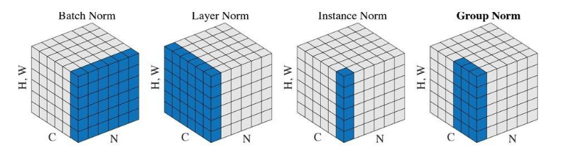

# 一、归一化层的概述

深度学习中的归一化层是在训练深度神经网络时为了解决某些关键问题而提出的，这些问题主要包括内部协变量偏移（internal covariate shift）、梯度消失/爆炸以及加速和稳定训练过程。

- 内部协变量偏移：在深度神经网络中，每一层的输入实际上是由前一层的输出决定的。随着训练的进行，这些输入的分布会不断变化，这种现象被称为内部协变量偏移。它使得每一层必须不断适应新的输入分布，这增加了训练的难度，延长了收敛时间，并可能导致次优解。
- 梯度消失/爆炸：在深度网络中，反向传播过程中梯度可能会变得非常小（梯度消失）或者非常大（梯度爆炸），这使得权重更新要么过于微弱无法有效调整，要么过于剧烈导致训练不稳定。

- 训练加速与稳定性：归一化层通过减少内部协变量偏移，可以使得每一层的输入具有更加稳定的统计特性，从而加快训练速度并提高训练的稳定性。此外，归一化层还可以帮助网络对初始权重的选择不那么敏感，允许使用更大的学习率，进一步加速训练。

# 二、归一化层原理介绍

1. **减少内部协变量偏移**：
    内部协变量偏移是指在网络训练过程中，中间层的输入分布随网络权重的更新而改变的现象。这种变化迫使每一层都必须不断地适应新的输入分布，这增加了训练的难度和不确定性，导致收敛速度变慢。归一化层通过将输入数据转换为具有固定均值和方差的形式，减少了这种变化，使网络更容易学习和优化。

2. **改善梯度流**：
    在深度网络中，梯度消失或梯度爆炸是常见的问题，它们分别发生在深层网络中梯度过小或过大，导致权重更新不充分或不稳定。归一化层通过保持梯度流的稳定，防止梯度在反向传播过程中变得过大或过小。这是因为归一化后的数据具有更均匀的尺度，有助于避免极端梯度值的出现。

3. **加速训练和提高稳定性**：
    归一化层可以加速神经网络的训练过程，因为它们使输入数据更接近于理想的学习范围，例如，接近于激活函数的最佳工作区间。这意味着网络可以使用较大的学习率，因为归一化后的梯度更稳定，不易导致训练过程失控。此外，归一化也有助于提高模型的泛化能力，因为它减少了对特定数据分布的依赖。

4. **统计学原理**：
    从统计学角度来看，归一化可以视为一种数据预处理步骤，它将数据转换成标准正态分布或其他预设的分布形式。这有助于确保所有特征都在相似的尺度上，消除了量纲和量级差异对模型训练的影响。在深度学习中，这通常意味着将数据归一化到均值为0，标准差为1的分布。

5. **增强模型鲁棒性**：
    归一化层还有助于模型的鲁棒性，即模型对输入数据的微小变化或噪声的抵抗能力。通过使模型对数据的规模和分布不那么敏感，归一化层可以使模型更加健壮，减少过拟合的风险。

# 三、重要的归一化层

## 3.1 Batch Normalization

### 3.1.1 基本介绍

Batch Normalization（BN）是一种用于加速深度神经网络训练的技术。它的主要目标是解决所谓的“内部协变量偏移”（internal covariate shift）问题，这个问题指的是在网络训练过程中，由于前面层的参数更新，导致后继层的输入分布发生变化，这会使得训练变得更加困难。对于一个具有(B, C, H, W)的特征，它需要沿着(B, H, W)的方向进行归一化，以保持输入的均值和方差不变。

BN层通过在每个mini-batch上对神经元的激活进行归一化，使得它们具有零均值和单位方差。这样可以减少各层之间的依赖，使得网络更容易训练，同时也有助于防止过拟合。

### 3.1.2 原理介绍

Batch Normalization的原理包括以下几个步骤：

1. **计算均值和方差**：对于一个给定的mini-batch，BN层首先计算所有样本在该层输出的均值和方差。

2. **归一化**：然后使用上述的均值和方差对每个mini-batch中的每个元素进行归一化，得到具有零均值和单位方差的输出。

3. **缩放和偏移**：为了保持网络的表达能力，BN层引入了两个可学习的参数`γ（scale）`和`β（shift）`，它们被用来缩放和偏移归一化的输出，使得网络仍然能够表示任何分布的输出。

BN的公式可以表示为：

$$
\hat{x} = \frac{x - \mu}{\sqrt{\sigma^2 + \epsilon}}
$$

其中，$x$ 是mini-batch中某个元素的原始输出，$\mu$ 和 $\sigma^2$ 分别是该mini-batch的均值和方差，$\epsilon$ 是一个小的常数，用于数值稳定性，$\hat{x}$ 是归一化后的输出。

最终输出为：

$$
y = \gamma \hat{x} + \beta
$$

### 3.1.3 代码实现

在Python中使用PyTorch框架实现BN层，代码如下：

```python
import torch.nn as nn

# 创建一个BN层实例，假设输入有64个通道
bn_layer = nn.BatchNorm2d(64)

# 假设x是一个形状为[N, 64, H, W]的张量，其中N是batch大小，H和W是特征图的高度和宽度
x = torch.randn(10, 64, 32, 32)

# 将输入传递给BN层
y = bn_layer(x)
```

### 3.1.4 优缺点

**优点**：

- 加速训练：BN层可以使网络更快收敛。
- 减少过拟合：通过引入额外的噪声，BN层有助于正则化模型。
- 减少对初始化的敏感度：BN层使得网络对权重初始化的选择不那么敏感。
- 简化超参数选择：BN层可以简化学习率等超参数的设置。

**缺点**：

- 计算成本：BN层增加了额外的计算和内存开销。
- **推理时的不确定性**：在推理阶段，BN层需要使用整个训练集的统计数据，这可能与mini-batch的统计有所偏差。
- **对于小批量训练效果不佳**：当mini-batch大小很小时，BN层的统计估计可能不够准确，从而影响性能。
- 在某些任务中可能不需要：对于某些简单任务或特定类型的网络结构，BN层可能不会带来显著的改进。

## 3.2 Layer Normalization

### 3.2.1 基本介绍

Layer Normalization（LN）是一种归一化技术，主要用于解决在训练深度神经网络时遇到的内部协变量偏移问题，特别是对于那些不需要依赖于样本间统计信息的模型，如循环神经网络（RNNs）和全连接网络。与Batch Normalization不同，Layer Normalization是在一个mini-batch中的每个样本的所有特征上独立进行的，而不是在特征维度上跨样本进行。对于一个具有(B, C, H, W)的特征，它需要沿着(C, H, W)的方向进行归一化，以保持输入的均值和方差不变。

### 3.2.2 原理介绍

Layer Normalization的基本思想是在每个训练样本的所有特征上进行归一化操作，而不是像Batch Normalization那样在mini-batch中跨样本进行。具体来说，对于一个给定的样本，LN会在其所有特征上计算均值和方差，然后使用这些统计量对每个特征进行归一化。这一过程可以确保每个样本的特征具有相同的统计特性，而不受其它样本的影响。

归一化公式如下：

$$
\mu = \frac{1}{N}\sum_{i=1}^{N} x_i
$$

$$
\sigma^2 = \frac{1}{N}\sum_{i=1}^{N} (x_i - \mu)^2
$$

$$
\hat{x}_i = \frac{x_i - \mu}{\sqrt{\sigma^2 + \epsilon}}
$$
 
其中，$x_i$  表示样本中的第 $i$ 个特征，$\mu$ 和 $\sigma^2$ 分别是特征的均值和方差，$\hat{x}_i$ 是归一化后的特征值，$\epsilon$ 是一个小的常数，用于防止除法时分母为零的情况。

接下来，LN也会使用可学习的缩放参数 $\gamma$ 和偏移参数$\beta$ 来调整归一化后的特征：

$$
y_i = \gamma \hat{x}_i + \beta
$$

### 3.2.3 代码实现

在Python中使用PyTorch框架实现Layer Normalization，代码如下：

```python
import torch.nn as nn

# 创建一个Layer Normalization层实例，假设输入有64个特征
ln_layer = nn.LayerNorm([64])

# 假设x是一个形状为[N, 64]的张量，其中N是batch大小
x = torch.randn(10, 64)

# 将输入传递给Layer Normalization层
y = ln_layer(x)
```

需要注意的是，`nn.LayerNorm`的构造函数接受一个列表作为参数，这个列表描述了输入数据中要被归一化的维度。在这个例子中，我们只有一维（即特征维度），所以传入了`[64]`。

### 3.2.4 优缺点

**优点**：

1. **适用于小批量训练**：LN不需要依赖于mini-batch的统计信息，因此对于小批量训练或者在线学习场景更为适用。
2. **简化RNN训练**：在RNN中，LN可以有效地减少长期依赖问题，因为每个时间步的隐藏状态都是独立归一化的，这有助于梯度流的稳定。
3. **更稳定的学习过程**：由于每个样本的特征都被归一化，LN可以提供更一致的学习信号，有助于稳定训练过程。

**缺点**：

1. **计算开销**：LN需要对每个样本的特征进行独立归一化，这在高维特征空间中可能会增加计算成本。
2. **可能不适合所有任务**：虽然LN在许多情况下有效，但在某些需要样本间交互信息的任务中，它可能不如BN有效。
3. **额外参数**：引入了$\gamma$ 和$\beta$ 这两个额外的可学习参数，增加了模型的复杂度。虽然这通常不是大问题，但在参数受限的环境中可能需要考虑。

总的来说，Layer Normalization为深度学习模型提供了一种有效的归一化策略，特别是在处理序列数据和小批量训练时。然而，选择最合适的归一化策略应该基于具体的应用场景和模型架构。

## 3.2 Instance Normalization

### 3.3.1 基本介绍

Instance Normalization（IN）是一种专门设计用于图像生成和样式转移任务的归一化技术。不同于Batch Normalization（BN）和Layer Normalization（LN），IN在每个样本的每个特征图上独立进行归一化，这意味着它在每个样本的每个通道上计算均值和方差，而不考虑批处理中的其他样本。这种特性使得IN非常适合处理图像数据，尤其是在需要保持每个图像样本内部特征一致性的情况下。

### 3.3.2 原理介绍

Instance Normalization的核心思想是保持每个样本内部的统计一致性，而不受批处理中其他样本的影响。在图像生成和样式转移任务中，这一点尤为重要，因为保持图像内部的风格一致性比匹配批处理中的其他样本更重要。对于一个具有(B, C, H, W)的特征，它需要沿着(H, W)的方向进行归一化操作，以保持输入的均值和方差不变。

对于一个给定的样本和其对应的特征图，IN的操作如下：

1. 对于每个特征图，计算所有位置上的均值和方差。
2. 使用这些统计量对特征图上的每个位置进行归一化，得到均值为0，方差为1的归一化特征图。
3. 最后，使用可学习的缩放参数 $\gamma$ 和偏移参数 $\beta$ 对归一化后的特征图进行缩放和偏移。

数学上，如果 $x$ 是特征图的一个像素点，则其归一化后的值 $\hat{x}$ 为：

$$
\hat{x} = \frac{x - \mu}{\sqrt{\sigma^2 + \epsilon}}
$$

其中， $\mu$ 和 $\sigma^2$ 分别是特征图的均值和方差， $\epsilon$ 是一个小的常数，用于数值稳定性。

最终的输出为：

$$
y = \gamma \hat{x} + \beta
$$

### 3.3.3 代码实现

在Python中使用PyTorch框架实现Instance Normalization，代码如下：

```python
import torch.nn as nn

# 创建一个Instance Normalization层实例，假设输入有64个通道
in_layer = nn.InstanceNorm2d(64)

# 假设x是一个形状为[N, 64, H, W]的张量，其中N是batch大小，H和W是特征图的高度和宽度
x = torch.randn(10, 64, 32, 32)

# 将输入传递给Instance Normalization层
y = in_layer(x)
```

### 3.3.4 优缺点

**优点**：

1. **保持样式一致性**：IN在图像生成和样式转移任务中表现出色，因为它保持了每个样本内部的风格一致性。
2. **独立于批处理大小**：IN的计算不依赖于批处理中的其他样本，因此对于小批量训练也十分有效。
3. **减少内部协变量偏移**：虽然所有归一化技术都旨在解决这一问题，但IN通过专注于每个样本的内部特性，提供了更针对性的解决方案。

**缺点**：

1. **可能不适合所有任务**：IN在图像生成和样式转移任务中效果显著，但在其他类型的数据集或任务上可能表现不佳，尤其是当样本间的交互非常重要时。
2. **计算开销**：虽然IN的计算复杂度通常低于BN，但在处理高分辨率图像时，每个样本的独立计算仍可能成为瓶颈。
3. **缺乏批处理统计信息**：IN忽略了批处理中样本间的统计信息，这在某些需要样本间相互作用的任务中可能是一个劣势。

总的来说，Instance Normalization是图像生成和样式转移任务中的一种强大工具，它通过保持每个样本内部的风格一致性，提高了模型的性能。然而，选择适当的归一化技术应基于具体的应用场景和数据类型。

## 3.4 Group Normalization

### 3.4.1 基本介绍

Group Normalization（GN）是一种旨在克服Batch Normalization（BN）在小批量训练中局限性的归一化方法。在深度学习模型中，特别是在卷积神经网络中，GN通过对特征图进行分组并在组内进行归一化来提高模型的稳定性和泛化能力。这种方法特别适用于在有限的计算资源下进行训练的情况，以及那些需要在小批量数据上运行的模型。

### 3.4.2 原理介绍

Group Normalization的基本思想是在每层的输出中将特征图分成若干个组，并在每个组内进行归一化操作。具体而言，假设我们有一个输入张量 $X$ ，它的维度是$$N \times C \times H \times W$$，其中 $N$ 是批量大小， $C$ 是通道数，而 $H$ 和 $W$ 分别代表高度和宽度。GN首先将 $C$ 个通道分成 $G$ 个组，然后对每个组内的所有通道进行归一化处理。

对于每一个组 $g$ ，GN计算该组所有通道的均值 $\mu_g$ 和方差 $\sigma^2_g$ ，然后对组内的每个通道应用归一化公式。归一化后的特征图再乘以可学习的缩放参数 $\gamma$ 并加上偏移参数 $\beta$ ，这两个参数的维度是 $C$ ，即与输入的通道数相同。

### 3.4.3 代码实现

使用PyTorch实现Group Normalization的一个例子如下：

```python
import torch.nn as nn

# 创建一个Group Normalization层实例，假设输入有64个通道，分成8个组
gn_layer = nn.GroupNorm(8, 64)

# 假设x是一个形状为[N, 64, H, W]的张量，其中N是batch大小，H和W是特征图的高度和宽度
x = torch.randn(10, 64, 32, 32)

# 将输入传递给Group Normalization层
y = gn_layer(x)
```

### 3.4.4 优缺点

**优点**：

1. **小批量训练的有效性**：GN在小批量训练中仍然能保持良好的性能，因为它不依赖于批处理内的统计信息，而是依赖于每个组内的统计信息。
2. **灵活性**：GN允许调整组的数量 $G$ ，这可以针对不同的模型架构和任务进行优化。
3. **减少内部协变量偏移**：与BN类似，GN也能减轻内部协变量偏移的问题，从而加速训练过程和提高模型的稳定性。

**缺点**：

1. **额外的超参数**：GN引入了一个新的超参数 $G$ ，即组的数量，这需要手动调整以获得最佳性能。
2. **可能的计算效率损失**：与BN相比，GN的计算效率可能较低，因为BN可以利用整个批处理的统计信息，而GN只在每个组内进行计算。
3. **可能的性能差异**：在某些特定任务中，GN可能不如BN或IN表现得好，这取决于数据的特性和模型的需求。

总之，Group Normalization是一种有效的归一化技术，尤其适合于小批量训练和资源受限的环境。通过合理地调整组的数量，可以平衡模型的计算效率和性能。然而，像任何技术一样，它也有自己的局限性，在实际应用中需要根据具体情况进行权衡和选择。

## 3.5 RMS Normalization

### 3.5.1 基本介绍

RMS Normalization（Root Mean Square Normalization）是一种改进的归一化技术，它基于Layer Normalization的概念，但去掉了减去均值的步骤，仅使用输入的平方根均值（RMS）来进行归一化。这种简化的方法在某些场景下能够提供更好的性能和更稳定的训练过程，尤其是在大规模语言模型和深度神经网络中。

### 3.5.2 原理介绍

RMS Normalization的核心思想是使用输入的平方根均值（RMS）来归一化输入，而不是像Layer Normalization那样先减去均值。在RMS Normalization中，对于一个给定的输入 $x$ ，我们首先计算其平方的平均值，然后取其平方根，这个值就是RMS。

具体步骤如下：

1. 对于输入张量的每个元素，计算平方。
2. 计算所有元素平方的平均值，即平方根均值（RMS）。
3. 对于每个元素，使用RMS值进行归一化。
4. 最后，使用可学习的缩放参数 $\rho$ 对归一化后的输出进行调整。

归一化公式如下所示：

$$
\text{RMS} = \sqrt{\frac{1}{N}\sum_{i=1}^{N} x_i^2}
$$

$$
\hat{x}_i = \frac{x_i}{\text{RMS} + \epsilon}
$$

$$
y_i = \rho \hat{x}_i
$$

其中， $\epsilon$ 是一个很小的常数，用于防止除以零的情况发生。

### 3.5.3 代码实现

在Python中使用PyTorch框架实现RMS Normalization，代码可以是这样的：

```python
import torch
import torch.nn as nn

class RMSNorm(nn.Module):
    def __init__(self, size, eps=1e-6):
        super(RMSNorm, self).__init__()
        self.scale = nn.Parameter(torch.ones(size))
        self.eps = eps

    def forward(self, x):
        norm_x = x.pow(2).mean(dim=-1, keepdim=True).add(self.eps).sqrt()
        return self.scale * x / norm_x

# 创建一个RMS Normalization层实例，假设输入有64个特征
rms_layer = RMSNorm(64)

# 假设x是一个形状为[N, 64]的张量，其中N是batch大小
x = torch.randn(10, 64)

# 将输入传递给RMS Normalization层
y = rms_layer(x)
```

### 3.5.4 优缺点

**优点**：

1. **简化计算**：RMS Normalization省去了计算均值的步骤，这在某些情况下可以简化计算流程，减少计算成本。
2. **稳定训练**：通过使用RMS进行归一化，可以避免由于减去均值而导致的潜在数值不稳定问题，尤其是在深度模型中。
3. **性能提升**：在一些实验中，RMS Normalization相较于Layer Normalization和其他归一化技术，在大型模型上表现出了更好的性能和收敛速度。

**缺点**：

1. **可能的统计信息丢失**：去掉减均值步骤可能在某些情况下导致统计信息的丢失，这可能会影响模型的性能，尤其是在数据分布有较大均值偏移的情况下。
2. **适应性限制**：尽管在某些模型中RMS Normalization表现出色，但它可能并不适用于所有类型的数据或模型架构。
3. **额外的参数**：虽然RMS Normalization简化了一些计算，但它引入了缩放参数 $\rho$ ，这增加了模型的参数数量。

总之，RMS Normalization作为一种归一化技术，通过简化Layer Normalization的计算流程，为深度学习模型的训练提供了另一种有效的选择。然而，就像所有技术一样，它也有其适用场景和限制，需要根据具体的模型和任务来判断是否使用。


总的来说，这些归一化的对比大概如图所示：


